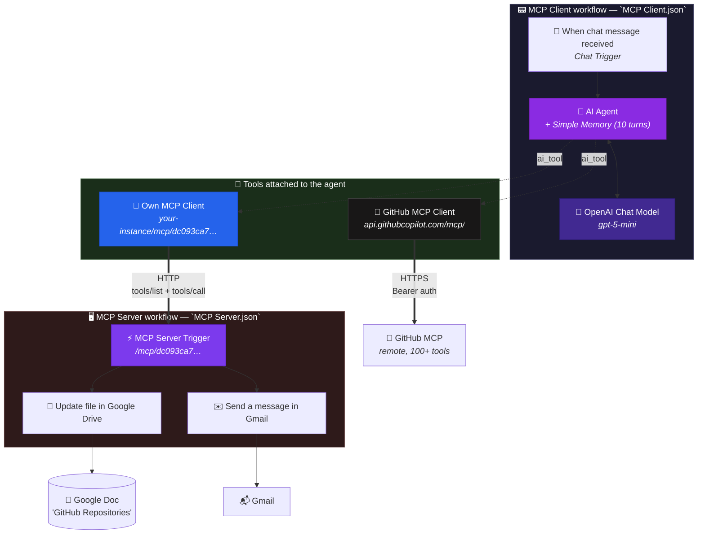
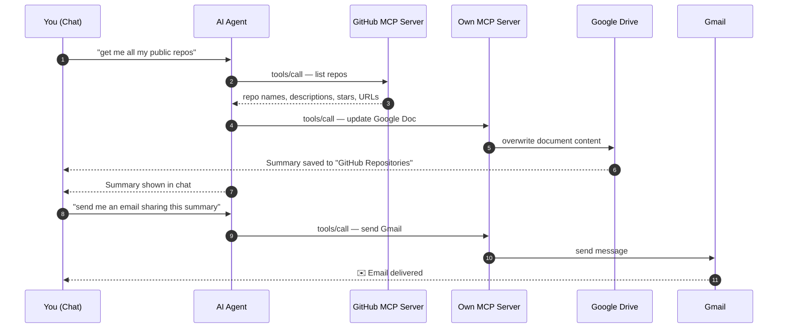

<div align="center">

# 🔌 NextLeap — Build MCP Server and Client

**An end-to-end [Model Context Protocol](https://modelcontextprotocol.io) build in n8n: expose Google Drive + Gmail as an MCP server, then drive it from an AI Agent that also talks to the official GitHub MCP server — turning "list my repos" into an emailed, document-backed summary.**

[](https://modelcontextprotocol.io)
[](https://n8n.io)
[](https://docs.n8n.io/integrations/builtin/cluster-nodes/)
[](https://docs.n8n.io/integrations/builtin/cluster-nodes/)
[](https://platform.openai.com)
[](https://github.com/github/github-mcp-server)
[](LICENSE)

</div>

---

## 📖 Overview

This repository contains two connected n8n workflows built during a **40-minute NextLeap AI workshop** on the Model Context Protocol.

| File | Role |
| --- | --- |
| [`MCP Server.json`](MCP%20Server.json) | **The server** — wraps Google Drive + Gmail as MCP tools |
| [`MCP Client.json`](MCP%20Client.json) | **The client** — an AI Agent that consumes *two* MCP servers |

### The core idea

MCP (Model Context Protocol) is **USB-C for AI tools**. One standard lets any MCP-compatible client consume tools from any MCP-compatible server — the same way a USB-C port accepts any cable.

Here's what that unlocks in this repo:

- You **build your own MCP server** once (2 tools: update a Google Doc, send a Gmail).
- Your AI Agent connects to it **alongside** the official **GitHub MCP server** — 100+ tools, zero configuration.
- The agent now spans **three different services** (GitHub + Google Drive + Gmail) while still behaving as one single reasoning loop.

> A typical n8n AI Agent can only call tools wired directly into it. MCP breaks that boundary — the agent can reach **any** MCP server in the world, including remote ones you didn't build.

---

## 🏗️ Architecture



### The full flow



---

## 📁 Part 1 — The MCP Server

[`MCP Server.json`](MCP%20Server.json) · workflow name: `MCP Server`

A workflow whose **trigger is an MCP endpoint** instead of a schedule or webhook. Every tool node connected to it is automatically exposed over MCP.

### Nodes

| # | Node | Type | Role |
| --- | --- | --- | --- |
| 1 | **MCP Server Trigger** | `@n8n/n8n-nodes-langchain.mcpTrigger` | Hosts the MCP endpoint at a secret path |
| 2 | **Update file in Google Drive** | `n8n-nodes-base.googleDriveTool` | **Tool** — overwrites a Google Doc with agent-supplied content |
| 3 | **Send a message in Gmail** | `n8n-nodes-base.gmailTool` | **Tool** — sends an email composed by the agent |

Both tool nodes connect to the trigger via the **`ai_tool`** connection type. That single connection is what registers them as MCP tools.

### Your endpoint

The trigger's `path` is the MCP URL segment:

```text
dc093ca7-20b6-420f-a85c-400c68dbc6b9
```

Once the workflow is **active**, n8n serves MCP at:

```text
https://<your-n8n-base-url>/mcp/dc093ca7-20b6-420f-a85c-400c68dbc6b9
```

> On n8n Cloud, `<your-n8n-base-url>` is your `https://<workspace>.app.n8n.cloud`. The path acts as a **capability secret** — anyone with the URL can call your tools, so treat it like a password and regenerate it if it leaks.

---

## 📁 Part 2 — The MCP Client

[`MCP Client.json`](MCP%20Client.json) · workflow name: `MCP Client`

A standard AI Agent with **two MCP Client Tools** attached — each pointing at a different server.

### Nodes

| # | Node | Type | Role |
| --- | --- | --- | --- |
| 1 | **When chat message received** | `@n8n/n8n-nodes-langchain.chatTrigger` | Chat UI entry point |
| 2 | **AI Agent** | `@n8n/n8n-nodes-langchain.agent` | The orchestrator / reasoning loop |
| 3 | **OpenAI Chat Model** | `@n8n/n8n-nodes-langchain.lmChatOpenAi` | `gpt-5-mini` via n8n AI Gateway |
| 4 | **Simple Memory** | `@n8n/n8n-nodes-langchain.memoryBufferWindow` | Remembers last **10** messages |
| 5 | **Own MCP Client** | `@n8n/n8n-nodes-langchain.mcpClientTool` | → your own server |
| 6 | **GitHub MCP Client** | `@n8n/n8n-nodes-langchain.mcpClientTool` | → official GitHub MCP server |

### The two MCP endpoints

| MCP Client Tool | Endpoint URL | Auth |
| --- | --- | --- |
| **Own MCP Client** | `https://gursimarankaur.app.n8n.cloud/mcp/dc093ca7-20b6-420f-a85c-400c68dbc6b9` | None (secret path) |
| **GitHub MCP Client** | `https://api.githubcopilot.com/mcp/` | **Bearer token** (`httpBearerAuth`) |

**Two facts worth internalising:**

1. **Local and remote look identical to the agent.** Your own server runs inside the same n8n instance; GitHub's runs on GitHub's infrastructure. The agent can't tell the difference — it just sees a tool list.
2. **Tool discovery is automatic.** The MCP Client Tool calls `tools/list` on connect and hands every tool it finds straight to the LLM. You never manually register GitHub's 100+ tools.

### Model note

The committed workflow uses **`gpt-5-mini`** through n8n's **AI Gateway** (`__aiGatewayManaged: true`). That means **no OpenAI API key is needed** — n8n Cloud proxies and bills the call. If you self-host n8n, attach your own `OpenAiApi` credential instead.

---

## 🏷️ The Most Important Part: MCP Tool Descriptions

You can expose a hundred tools and still get bad results. **The tool description *is* the prompt.** MCP clients paste it verbatim to the LLM — there is no other documentation the model ever sees.

This repo's two tools are described as:

**📄 Update file in Google Drive**
> Use this tool to update the Google document. You need to pass just the content to be updated.

**✉️ Send a message in Gmail**
> Use this tool to Send a message in Gmail. All you send is the to email address, subject and message body to send this email.

### Why the wording matters so much

| Phrase you write | What the model does |
| --- | --- |
| *"update the Google document"* | ✅ Knows **what** it does |
| *"pass just the content to be updated"* | ✅ Knows **which argument** to fill and that the rest are pre-configured |
| *"send a message in Gmail"* | ✅ Knows the action |
| *"the to email address, subject and message body"* | ✅ Knows it must supply **all three**, not just a body |

Compare these:

```text
❌  BAD   "Sends email"
         → Model doesn't know it needs To/Subject/Body. Sends garbage or fails.

❌  BAD   "Update doc. Args: data, fileId, options, binaryData"
         → Technical parameter names leak to the model. It will try to invent a fileId.

✅  GOOD  "Update the Google document. Pass just the content to be updated."
         → One clear instruction, one thing to pass, human vocabulary.
```

### Rules of thumb

1. **Start with "Use this tool to…"** — unambiguous trigger for when to reach for it.
2. **Describe *your* workflow, not the API.** The model doesn't know n8n node internals.
3. **Say exactly which parameters YOU fill.** Any parameter you hardcode, tell the model it's already handled.
4. **Distinguish sibling tools.** If you add *create* doc and *update* doc, each description must say which one.
5. **Give examples when ambiguous.** A one-line example eliminates most miscalls.
6. **Say what NOT to use it for.** Negative boundaries are as valuable as positive ones.

---

## 🚀 Setup Guide

### Step 1 — Import and configure the MCP Server

1. **Workflows → Import from File** → [`MCP Server.json`](MCP%20Server.json).
2. Attach credentials:

   | Node | Credential | Scope |
   | --- | --- | --- |
   | Update file in Google Drive | `Google Drive account` | `https://www.googleapis.com/auth/drive` |
   | Send a message in Gmail | `Gmail account` | `https://www.googleapis.com/auth/gmail.send` |

3. **Update file in Google Drive → File** → select **your own** Google Doc (the exported file ID belongs to the original author's document).
4. **Send a message in Gmail → Send To** → set your email address.
5. Click **Active**, then open the trigger and copy the **MCP endpoint URL**.

### Step 2 — Import and configure the MCP Client

1. **Workflows → Import from File** → [`MCP Client.json`](MCP%20Client.json).
2. **Own MCP Client → Endpoint URL** → replace with the URL you copied in Step 1:
   ```text
   https://<your-base-url>/mcp/<your-path>
   ```
   > The exported URL points at the original author's n8n Cloud instance. **This will not work until you change it.**
3. **GitHub MCP Client → Endpoint URL** → `https://api.githubcopilot.com/mcp/`
4. **GitHub MCP Client → Authentication** → `Bearer Auth` → paste a GitHub token with MCP access (a fine-grained PAT or a Copilot premium-request token).
5. **OpenAI Chat Model** → on n8n Cloud, leave the AI Gateway credential; if self-hosted, attach your own `OpenAiApi` key.
6. Click **Active** and open the chat.

### Step 3 — Verify the tool handshake

Open the client execution log and look for a `tools/list` call. You should see **your two tools plus GitHub's** loaded into the agent's tool list. If your own two are missing, the server workflow isn't active or the path is wrong.

---

## 🎬 Demo Script

With both workflows active, open the chat and send these prompts in order.

**Prompt 1 — pull data from GitHub, write it to Google Drive**

> get me all my public repos from my github account

The agent will:
1. Call the GitHub MCP server to list repositories
2. Summarise them
3. Call your own MCP server → **Update file in Google Drive**, writing the summary into your Doc
4. Return the summary in chat

**Prompt 2 — send the result over email**

> send me a email sharing this summary of all my public github repositories

The agent will reuse the summary (thanks to **Simple Memory**) and call your own MCP server → **Send a message in Gmail**.

> 💡 Memory is what makes this two-shot flow work. Without the buffer window, the agent would have to re-query GitHub in prompt 2. This is the clearest demonstration in the repo of why memory is more than a nice-to-have.

---

## 🛠️ Adding Your Own Tool to the Server

This is the payoff of MCP — the agent picks up new capabilities with **zero client changes**.

1. Open `MCP Server.json`
2. Add any tool node (**Slack**, **Notion**, **Postgres**, **HTTP Request**…)
3. Connect it to **MCP Server Trigger** via the `ai_tool` port
4. Write a clear **tool description** (see the rules above)
5. Save, ensure the workflow is **Active**
6. Refresh the client chat — the new tool is already there

No client edit. No re-wiring. That's the protocol working.

---

## 🔧 Troubleshooting

| Symptom | Likely cause | Fix |
| --- | --- | --- |
| `404` on the MCP endpoint | Server workflow inactive | Toggle **Active** on `MCP Server` |
| Agent can't see custom tools | Client cached the old tool list | Refresh the chat / re-open the workflow, then retry |
| `401` from GitHub MCP | Missing/expired bearer token | Re-create the **Bearer Auth** credential |
| GitHub MCP returns no repos | Token lacks repo scope | Use a fine-grained PAT with **public repo read** access |
| `403` from Google Drive | Drive scope missing, or Doc not shared | Re-authorise with `drive` scope; confirm you own the Doc |
| Agent asks for a `fileId` | Tool description is unclear | Rewrite it: *"Pass just the content to be updated"* |
| Model invents arguments | Description exposes raw API params | Describe the *task*, never the parameter names |
| Prompt 2 forgets the summary | Memory not attached | Confirm **Simple Memory** is wired via `ai_memory` |
| n8n Cloud prompts for an OpenAI key | AI Gateway not enabled | Switch the model credential to the n8n AI Gateway, or attach your own key |

---

## 📊 MCP Tools vs Native n8n Tool Nodes

| | Native tool node | MCP Client Tool |
| --- | --- | --- |
| **Built-in** | Ships with n8n | Any MCP server, incl. remote |
| **Catalogue size** | ~400 n8n nodes | 100+ GitHub tools alone, and growing |
| **Reusable outside n8n** | ❌ n8n-only | ✅ Claude Desktop, Cursor, LangChain, anything MCP |
| **Setup** | Drag node, wire credential | Paste one URL (+ auth) |
| **Auth handled by** | n8n credential store | The server; client just passes a token |
| **Discovery** | You wire each node | Automatic via `tools/list` |
| **Cost** | Free (n8n nodes) | Server owner's API costs; GitHub MCP is free tier |

**They compose.** Nothing stops you attaching native n8n tools *and* MCP Client Tools to the same agent.

---

## 📂 Project Structure

```text
NextLeap-Built-MCP-Server-and-Client-04-October-2026/
├── MCP Server.json   # Server workflow — Google Drive + Gmail as MCP tools
├── MCP Client.json   # Client workflow — AI Agent + 2 MCP servers
├── README.md         # You are here
└── LICENSE           # MIT
```

---

## 🎓 Workshop Context

Built as part of a **NextLeap AI Engineer bootcamp** session.

| Segment | Duration | Focus |
| --- | --- | --- |
| Build MCP Server and Client | 40 mins | `mcpTrigger`, `mcpClientTool`, tool descriptions, remote servers |

**Key takeaway:** tools are the *capability*; MCP is the *standard for shipping them anywhere*. Once your tools speak MCP, every MCP client in the world can use them — including the one you just built.

---

## 📄 License

Released under the [MIT License](LICENSE).

---

## 👤 Author

**Gursimaran** — [GitHub @Gursimaran21](https://github.com/Gursimaran21)

---

## 🔗 Related

- [Model Context Protocol](https://modelcontextprotocol.io) · [Specification](https://modelcontextprotocol.io/specification)
- [GitHub MCP Server](https://github.com/github/github-mcp-server)
- [n8n MCP docs](https://docs.n8n.io/integrations/builtin/cluster-nodes/)
- Previous workshop: [Google Calendar AI Assistant](https://github.com/Gursimaran21/NextLeap-Google-Calendar-Assistant-04-October-2026)

---

<div align="center">

**Built with 🔌, 🧠 and the Model Context Protocol.**

</div>